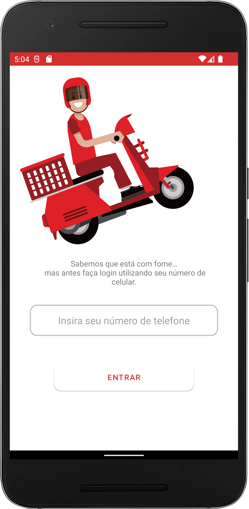

<h1 align="center">Fenícios - Sistema de delivery</h1>

 
  O Sistema Fenícios é composto de duas aplicações, ambas mobile uma feita apenas para interação com o usuário e outra apenas para o proprietário do estabelecimento, onde pode acessar e ter controle de seu aplicativo com privilégios como criar/excluir/modificar produtos, controle financeiro, receber pedidos e modificar o status dos mesmos entre três estados [Pendente, Em preparo e Enviado] entre outras funcionalidades. 

<h1 align="center">Aplicação em desenvolvimento</h1>

Tabela de conteúdos
=================
<!--ts-->
   * [Repositório das Aplicações](#repositório-das-aplicações-book)
   * [Tecnologias](#tecnologias-rocket)
   * [Fotos](#screenshots-camera)
   * [Gifs](#gifs-movie_camera)
   * [Autor](#autor) 
<!--te-->

## Repositório das Aplicações :book:

- Fenícios para usuários -> [clique aqui](https://kotlinlang.org/)
- Fenícios para proprietários -> [clique aqui](https://firebase.google.com/)

## Tecnologias :rocket:

As seguintes ferramentas estão sendo utilizadas no desenvolvimento do projeto:

- [Kotlin](https://kotlinlang.org/)
- [Firebase](https://firebase.google.com/)
- [Lottie](https://lottiefiles.com/)
- [Glide](https://github.com/bumptech/glide)
- [Mercado Pago API](https://www.mercadopago.com.br/developers/pt/docs/checkout-pro/landing)

## Screenshots :camera: 

<h1 align="center">
  
  
  </h1>
  
## Autor

Feito por André Esperança!

Contatos :
 

<a href="https://github.com/andreesperanca">
   
 
  
  <a href="https://github.com/andreesperanca" title="">André Esperança</a>
